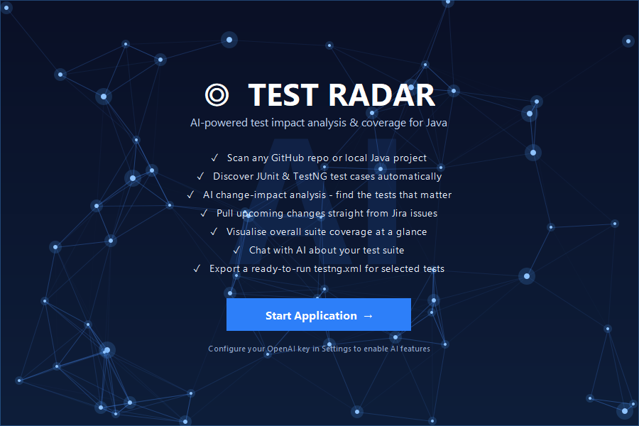

# Test Radar

AI-powered **test impact analysis** and **coverage explorer** for Java test suites - a desktop app built with Java Swing and a flat, modern FlatLaf theme.



## Features

- **Scan Repository** - clone any GitHub repo (or open a local Java project) and auto-discover its test suite (JUnit 4/5 & TestNG).
- **Analyse Change** - describe an upcoming change (type it, or **fetch it from a Jira issue**); AI identifies the relevant tests, ranked by relevance with reasons.
- **Coverage** - heuristic, static estimate of which production classes are exercised by the suite (no test execution required), with a donut chart and per-class breakdown.
- **AI Chat** - ask anything about the loaded test suite.
- **Settings** - OpenAI API key/model, optional Jira credentials, and theme selection.
- **Export `testng.xml`** - select the relevant tests and export a ready-to-run TestNG suite file.
- **Animated splash screen** - neural-network background with a *Start Application* button.

## Requirements

- **To build:** JDK 17+ and Maven.
- **To run the packaged app:** only **Java 17+** (all dependencies are bundled into the fat jar).

## Build

```bash
mvn clean package
```

This produces a self-contained fat jar at `target/test-radar.jar`.

## Run

Double-click `target/test-radar.jar`, or:

```bash
java -jar target/test-radar.jar
```

During development you can also run:

```bash
mvn exec:java
```

## Configuration

Copy [`config.properties.example`](config.properties.example) to `~/.testradar/config.properties` and fill in your values (or use the in-app **Settings** tab, which writes the same file). Settings are stored at `~/.testradar/config.properties`:

```properties
openai.apiKey=sk-...
openai.model=gpt-4o-mini
openai.baseUrl=https://api.openai.com/v1
ui.theme=FlatLaf Light
jira.baseUrl=https://your-domain.atlassian.net
jira.email=you@example.com
jira.apiToken=...
```

You can edit this file directly or use the **Settings** tab in the app. The Jira API token is created at <https://id.atlassian.com/manage-profile/security/api-tokens>.

## Notes

- Coverage is a **static heuristic** (naming conventions + symbol references), not execution-based coverage like JaCoCo.
- AI features (change analysis, chat) require a valid OpenAI API key.
